# Comprehensive Analysis Report

Generated: `2026-04-25 16:26:35`

## Executive Summary

- Best model: `random_forest`
- Best validation accuracy: `0.9956625785222853`
- Train/val samples: `113658` / `20058`
- Kaggle status: `skipped`

## Model Comparison Metrics

| model | accuracy | macro_f1 | train_seconds | predict_ms_per_sample |
| --- | --- | --- | --- | --- |
| random_forest | 0.9956625785222852 | 0.9837468971350202 | 19.837264899979346 | 0.0201282520697779 |
| svm_rbf | 0.9879848439525376 | 0.963028220073856 | 30.011639400036078 | 1.2611291554504525 |
| mlp | 0.9871871572439924 | 0.9600896104721148 | 58.856272199889645 | 0.0006851201529876 |
| knn | 0.9828497357662778 | 0.9609478545939262 | 0.0153538999147713 | 0.0663633492861345 |

## Hardest Confused Pairs (Top 3 per model)

| model | true_label | pred_label | count |
| --- | --- | --- | --- |
| mlp | N | M | 20 |
| mlp | M | N | 11 |
| mlp | R | U | 11 |
| random_forest | N | M | 19 |
| random_forest | M | N | 5 |
| random_forest | O | space | 4 |
| svm_rbf | U | R | 15 |
| svm_rbf | N | M | 14 |
| svm_rbf | R | U | 11 |
| knn | N | M | 49 |
| knn | M | N | 16 |
| knn | D | O | 14 |

## Runtime Benchmark Summary

- Classifier-only mean (ms/sample): `0.01940563939604082`
- Classifier-only std (ms/sample): `0.0011302073505779183`
- End-to-end status: `ok`
- End-to-end mean (ms/frame): `86.93679126521542`
- End-to-end std (ms/frame): `5.186892396559548`
- End-to-end samples used: `183`

## Kaggle 29-image Evaluation

- Status: `skipped`
- Reason: `directory_not_found:D:\Documents\School\College\2025-2026\ECE460J\ECE460J-Final-Project\kaggle-test-images`
- Images total / scored: `0` / `0`
- Accuracy: `None`

## Promotion Summary

- Promoted model path: `D:\Documents\School\College\2025-2026\ECE460J\ECE460J-Final-Project\final-submission\model.pkl`
- Promoted encoder path: `D:\Documents\School\College\2025-2026\ECE460J\ECE460J-Final-Project\final-submission\label_encoder.pkl`
- Source model artifact: `D:\Documents\School\College\2025-2026\ECE460J\ECE460J-Final-Project\analysis\reports\model_comparison\best_model.pkl`
- Source encoder artifact: `D:\Documents\School\College\2025-2026\ECE460J\ECE460J-Final-Project\analysis\reports\model_comparison\label_encoder.pkl`

## Artifact Links

### Model Comparison Artifacts

- [`analysis/reports/model_comparison/best_model.pkl`](model_comparison/best_model.pkl)
- [`analysis/reports/model_comparison/best_model_summary.json`](model_comparison/best_model_summary.json)
- [`analysis/reports/model_comparison/classification_reports.json`](model_comparison/classification_reports.json)
- [`analysis/reports/model_comparison/hardest_confusions_knn.csv`](model_comparison/hardest_confusions_knn.csv)
- [`analysis/reports/model_comparison/hardest_confusions_mlp.csv`](model_comparison/hardest_confusions_mlp.csv)
- [`analysis/reports/model_comparison/hardest_confusions_random_forest.csv`](model_comparison/hardest_confusions_random_forest.csv)
- [`analysis/reports/model_comparison/hardest_confusions_svm_rbf.csv`](model_comparison/hardest_confusions_svm_rbf.csv)
- [`analysis/reports/model_comparison/label_encoder.pkl`](model_comparison/label_encoder.pkl)
- [`analysis/reports/model_comparison/metrics_summary.csv`](model_comparison/metrics_summary.csv)
- [`analysis/reports/model_comparison/mlp_loss_curve.json`](model_comparison/mlp_loss_curve.json)

### Confusion Matrix Plots

- [`analysis/reports/model_comparison/confusion_matrix_knn.png`](model_comparison/confusion_matrix_knn.png)
- [`analysis/reports/model_comparison/confusion_matrix_mlp.png`](model_comparison/confusion_matrix_mlp.png)
- [`analysis/reports/model_comparison/confusion_matrix_random_forest.png`](model_comparison/confusion_matrix_random_forest.png)
- [`analysis/reports/model_comparison/confusion_matrix_svm_rbf.png`](model_comparison/confusion_matrix_svm_rbf.png)

### Confusion Matrix Displays

#### `confusion_matrix_knn.png`

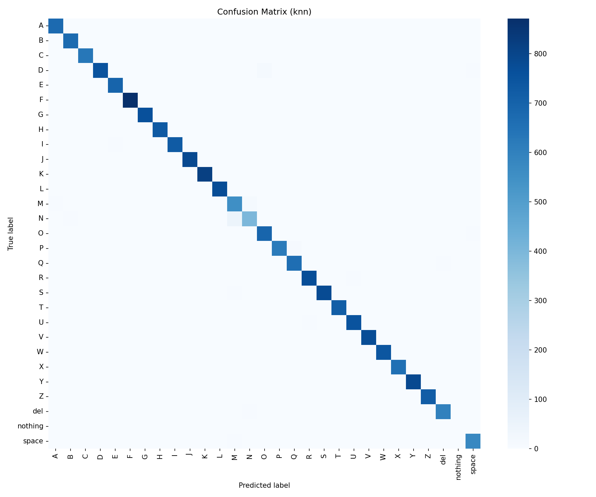

#### `confusion_matrix_mlp.png`

#### `confusion_matrix_random_forest.png`

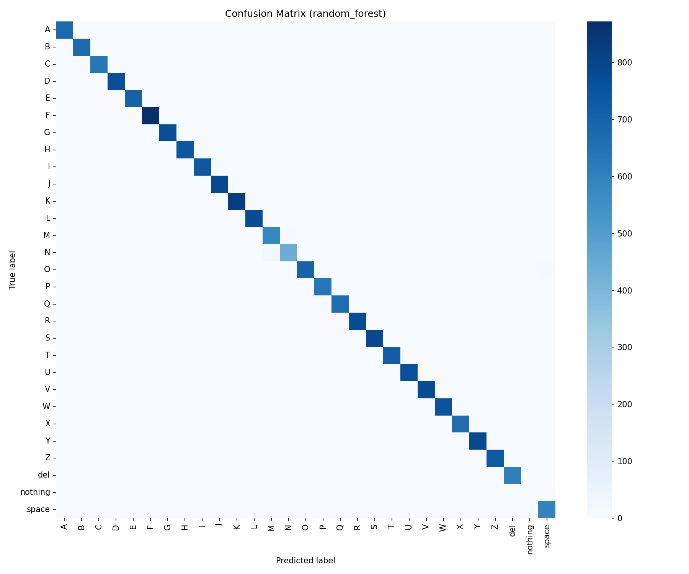

#### `confusion_matrix_svm_rbf.png`

### Visualization Plots

- [`analysis/plots/outputs/asl_accuracy_grid.png`](../plots/outputs/asl_accuracy_grid.png)
- [`analysis/plots/outputs/before_after_normalization.png`](../plots/outputs/before_after_normalization.png)
- [`analysis/plots/outputs/class_distribution.png`](../plots/outputs/class_distribution.png)
- [`analysis/plots/outputs/landmark_tsne.png`](../plots/outputs/landmark_tsne.png)
- [`analysis/plots/outputs/landmark_umap.png`](../plots/outputs/landmark_umap.png)
- [`analysis/plots/outputs/mediapipe_skeleton_overlay.png`](../plots/outputs/mediapipe_skeleton_overlay.png)
- [`analysis/plots/outputs/mlp_loss_curve.png`](../plots/outputs/mlp_loss_curve.png)
- [`analysis/plots/outputs/per_class_accuracy.png`](../plots/outputs/per_class_accuracy.png)
- [`analysis/plots/outputs/rf_feature_importance_top20.png`](../plots/outputs/rf_feature_importance_top20.png)

### Visualization Displays

#### `asl_accuracy_grid.png`

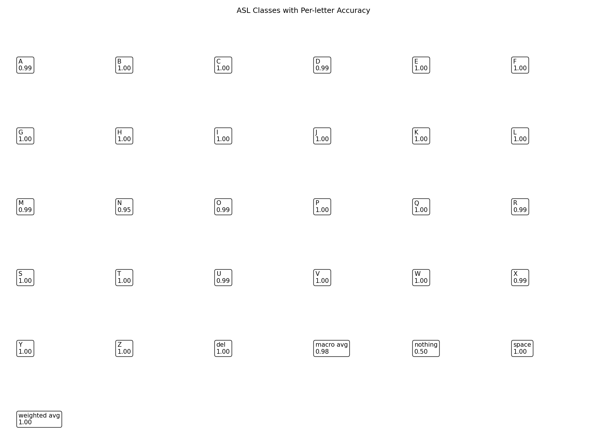

#### `before_after_normalization.png`

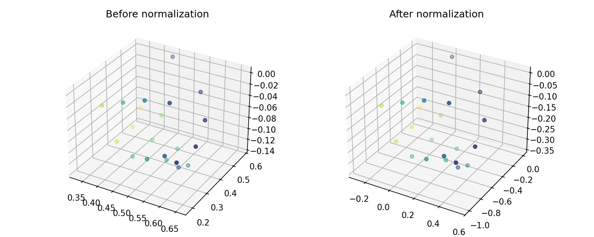

#### `class_distribution.png`

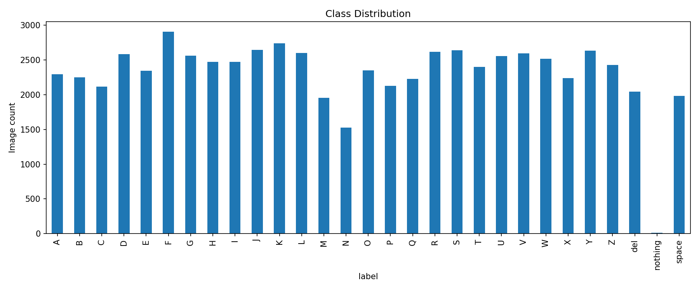

#### `landmark_tsne.png`

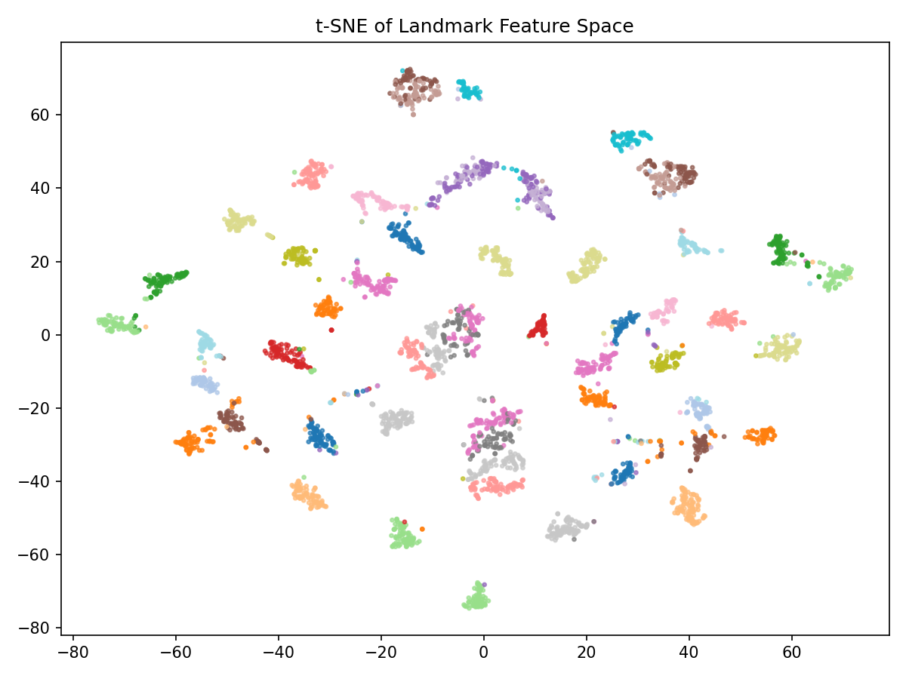

#### `landmark_umap.png`

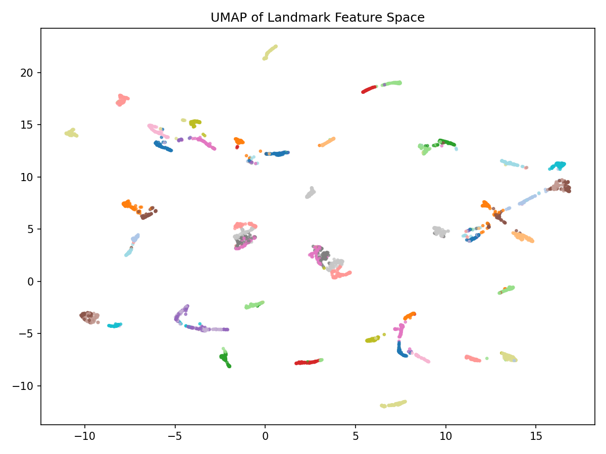

#### `mediapipe_skeleton_overlay.png`

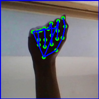

#### `mlp_loss_curve.png`

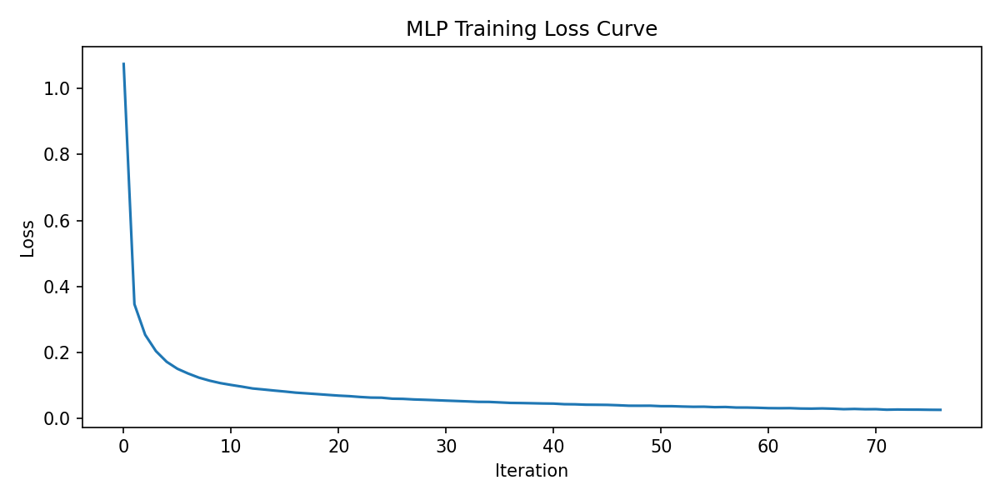

#### `per_class_accuracy.png`

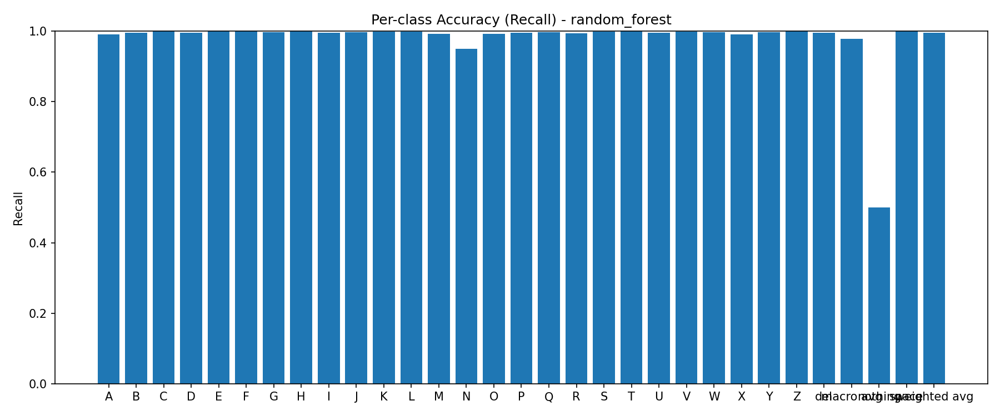

#### `rf_feature_importance_top20.png`

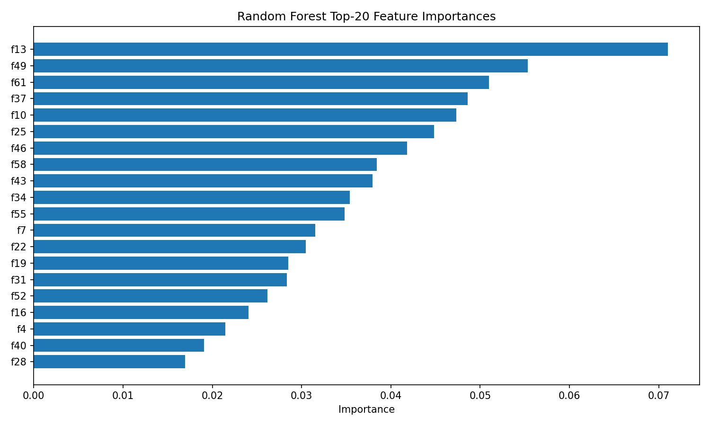

### Benchmark And Evaluation Outputs

- [`analysis/reports/benchmark_results.json`](benchmark_results.json)
- [`analysis/reports/kaggle29_summary.json`](kaggle29_summary.json)
- [`analysis/reports/promotion_log.json`](promotion_log.json)

### Manual Trial Outputs

- [`analysis/manual_trials/manual_trial_log.csv`](../manual_trials/manual_trial_log.csv)
- [`analysis/manual_trials/manual_trial_template.csv`](../manual_trials/manual_trial_template.csv)
- [`analysis/manual_trials/outputs/accuracy_by_confirm_frames.csv`](../manual_trials/outputs/accuracy_by_confirm_frames.csv)
- [`analysis/manual_trials/outputs/accuracy_by_window.csv`](../manual_trials/outputs/accuracy_by_window.csv)
- [`analysis/manual_trials/outputs/accuracy_vs_confirm_frames.png`](../manual_trials/outputs/accuracy_vs_confirm_frames.png)
- [`analysis/manual_trials/outputs/accuracy_vs_window_size.png`](../manual_trials/outputs/accuracy_vs_window_size.png)
- [`analysis/manual_trials/trial_matrix.csv`](../manual_trials/trial_matrix.csv)

### Manual Trial Diagram Displays

#### `accuracy_vs_confirm_frames.png`

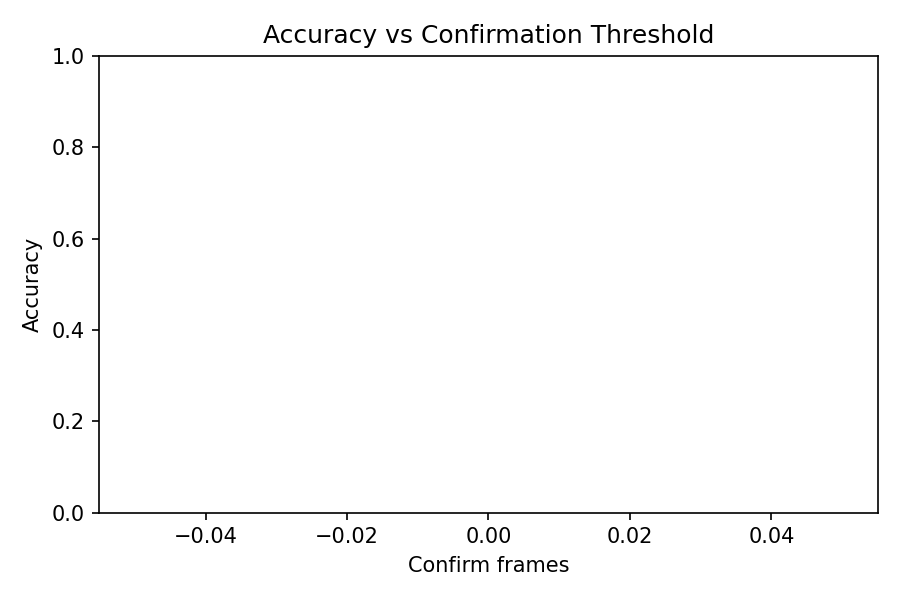

#### `accuracy_vs_window_size.png`

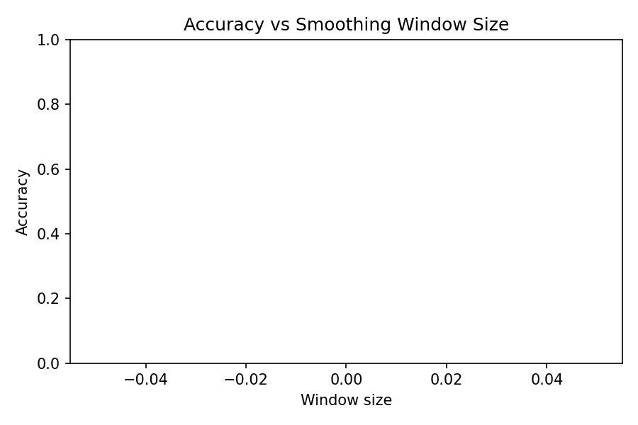

## Source Scripts Used

- [`analysis/benchmarks/benchmark_inference.py`](../benchmarks/benchmark_inference.py)
- [`analysis/common.py`](../common.py)
- [`analysis/experiments/evaluate_kaggle29.py`](../experiments/evaluate_kaggle29.py)
- [`analysis/experiments/model_comparison.py`](../experiments/model_comparison.py)
- [`analysis/experiments/promote_best_model.py`](../experiments/promote_best_model.py)
- [`analysis/manual_trials/generate_trial_matrix.py`](../manual_trials/generate_trial_matrix.py)
- [`analysis/manual_trials/summarize_manual_trials.py`](../manual_trials/summarize_manual_trials.py)
- [`analysis/plots/generate_visualizations.py`](../plots/generate_visualizations.py)
- [`analysis/run_analysis_suite.py`](../run_analysis_suite.py)

## Data Inputs Used

- [`analysis/manual_trials/manual_trial_log.csv`](../manual_trials/manual_trial_log.csv)
- [`analysis/manual_trials/trial_matrix.csv`](../manual_trials/trial_matrix.csv)
- [`final-submission/hand_landmarker.task`](../../final-submission/hand_landmarker.task)
- [`final-submission/landmarks.csv`](../../final-submission/landmarks.csv)
